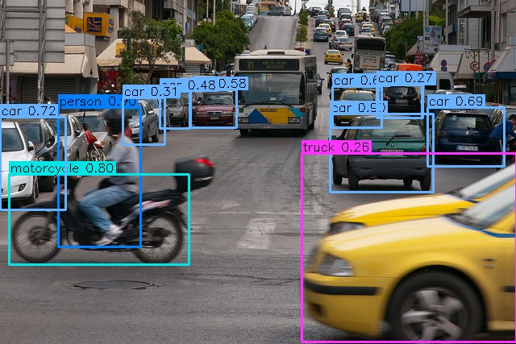
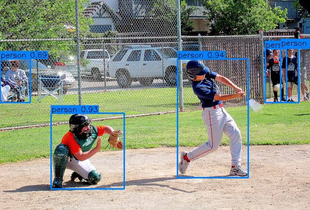

# Flash-YOLO

> ⚡ **Flash-YOLO: a super-lightweight architecture, 31% fewer GFLOPs than YOLO26n. Millisecond inference on GPU and CPU — all inside a complete, independent framework: train · evaluate · export · infer, raw dataset in, TensorRT engine out.**
>
> No monolithic abstractions, no heavyweight dependencies — core runtime is just PyTorch + NumPy.

<p align="center">
  <a href="CHANGELOG.md"></a>
  <a href="LICENSE"></a>
  <a href="https://www.python.org/downloads/"></a>
  <a href="https://pytorch.org/"></a>
</p>

<p align="center">
  
  
  <br>
  <em>Detections by flash-yolo — COCO val2017 samples, 640 input</em>
</p>

| Model | mAP@[.5:.95] | mAP@50 | Params | GFLOPs @640 | ORT-CPU b1 (ms) | TRT b1 fp32 (ms) | TRT b8 fp32 (ms/img) | TRT b8 fp16 (ms/img) |
|---|---|---|---|---|---|---|---|---|
| YOLO26n · official weights | 40.27 | 55.80 | 2.57M | 5.48 | —³ | 1.38 | 0.252 | 0.141 |
| YOLO26n · this repo, 100 ep | 36.22 | 51.32 | 2.57M | 5.48 | —³ | 1.38 | 0.252 | 0.141 |
| flash-yolo · this repo, 100 ep | —¹ | —¹ | 1.97M | 3.80 | —³ | 1.33 | 0.213 | 0.130 |
| **Δ (flash-yolo vs YOLO26n)** | — | — | **−0.60M (−23%)** | **−1.68 (−31%)** | **—** | **−0.05 (−4%)** | **−0.039 (−15%)** | **−0.011 (−8%)** |

¹ flash-yolo's 100-epoch run is in progress — its COCO numbers land on completion (structure and latency are architecture facts, already final). ² COCO val2017 · pycocotools · E2E (NMS-free) at 640; speed: TensorRT on one RTX 5090, inference stage, best-case min across repeated runs on a shared box (two trainings ran throughout) — b1 fp16 is ~1.20 ms for both models (the b1 column above is the fp32 chain). Δ compares against the budget-matched from-scratch YOLO26n — for structure/latency both YOLO26n rows are identical. Details: [Results](#results) · [Export & Deployment](#export--deployment). ³ ORT-CPU (Intel Xeon Platinum 8470Q, 25-core container quota) is pending a quiet re-measurement — under the current training load the CPU delta is not measurable reliably.

- **Reproduces YOLO26n bit-identically** — the official weights load with zero key mapping
  (260 layers · 2,572,280 params) and the inference output is bit-for-bit identical. COCO val2017
  through this pipeline: **40.27** mAP@[.5:.95] E2E (NMS-free) / **40.89** with NMS — published: 40.1 / 40.9.
- **Trains from scratch, and says so** — no official checkpoint was trained on COCO from random
  weights; this repo's own from-scratch baseline (100 epochs, one RTX 5090) reaches **36.22 / 51.32**
  — the honest reference point for what a 100-epoch budget buys.
- **A second architecture, end to end** — **YOLOv3-tiny**, darknet-faithful, selected with
  `--model yolov3-tiny` across train / eval / infer / export; the official darknet weights verified
  through the same pipeline (**17.16** mAP@[.5:.95] @640).
- **Its own lightweight model** — **flash-yolo**: a single-variable screened design that keeps
  YOLO26's three detection levels (P3/P4/P5) — scorecard in the table above, design story in
  [Flash-YOLO](#flash-yolo).
- **Three runtimes, one contract** — PyTorch / ONNX Runtime (CPU) / TensorRT (GPU, fp32 **and**
  fp16) all answer the same `predict()`; `scripts/export.py` chains safetensors → onnx → serialized
  engine in one command (see [Export & Deployment](#export--deployment)).
- **Small on dependencies, big on verification** — core runtime is PyTorch + NumPy; every module is
  readable on its own and covered by 168 tests (weight alignment, export parity, loss parity,
  format equivalence, engine correctness) — see [Project Structure](#project-structure).

## Quick Start

Prerequisites — install, then prepare the official weights once (AGPL-3.0, personal research /
verification use only; conversion writes pure safetensors — the runtime never needs ultralytics):

```bash
pip install -r requirements.txt
python scripts/download_weights.py --model yolo26n
python scripts/convert_weights.py --src weights/yolo26n.pt --dst weights/yolo26n.safetensors
```

Then each of the four workflows is one command away:

### Train

```bash
# from scratch on your dataset (--data is a descriptor, see "Datasets"; ~14 h on one RTX 5090)
python scripts/train.py --data /path/to/coco.yaml --name my-run --batch 64 --workers 16
```

### Evaluate

```bash
# formal pycocotools numbers for the run you just trained
python scripts/eval.py --weights runs/train/my-run/weights/best.safetensors --data /path/to/coco.yaml
```

### Export

```bash
# safetensors -> onnx -> TensorRT engine (fp32; add --fp16 for the half-precision deployment build)
python scripts/export.py --weights weights/yolo26n.safetensors --trt
python scripts/export.py --weights weights/yolo26n.safetensors --trt --fp16
```

### Inference

```bash
# E2E NMS-free by default; --nms for the o2m path, --engine onnx|trt to switch runtimes;
# --image takes a file or a directory
python scripts/infer.py --weights weights/yolo26n.safetensors --image assets/traffic.jpg
python scripts/infer.py --weights weights/yolo26n.safetensors --image assets/
```

## Datasets

Datasets are described by a small yaml (schema + template: `config/datasets/coco.yaml`):

```yaml
format: coco                 # coco (json annotations) | yolo (labels/*.txt)
path: /path/to/coco          # dataset root — machine paths live here, not in code
names: [person, ...]         # class names, index = class id; the model's nc follows this list
train:
  images: images/train2017
  ann: annotations/instances_train2017.json      # coco only; yolo reads labels/ next to images
val:
  images: images/val2017
  ann: annotations/instances_val2017.json
```

`--data <name|.yaml>` is the entry for train / eval / bench_io; name lookup prefers
`config/datasets/local/<name>.yaml` (gitignored — that is where machine paths belong) over the
shipped templates. Roles replace split names (`eval --split` picks one, default `val`). YOLO-format
datasets skip `ann` and read `labels/*.txt` (`cls xc yc w h`, normalized; `labels:` is optional and
defaults to the `images` path with its `images` segment swapped for `labels`). Missing/empty label
files count as backgrounds, and a labels dir with zero hits fails loudly instead of training on
100 % background. The model's class count comes from `names` (no model-yaml edit for custom
datasets), and the downstream end of the chain takes the same numbers: `infer --data <name|.yaml>`
(nc + label names) and `export --nc N` (ONNX head).

Tiny datasets for a fast loop: `scripts/make_coco_subset.py` extracts a seeded N-image subset of an
existing COCO root, hard-links the images, writes coco/yolo descriptors (copied into
`config/datasets/local/`, so `--data coco-tiny` resolves), and prints the
`dataflow-cv convert coco2yolo` commands — a 2,000/1,000-image subset turns a full train + eval
cycle into minutes.

## Training

Batch size and worker count are machine-dependent and deliberately not baked in (`16 / 8` are the
minimal portable values); `scripts/bench_io.py` sweeps loader-only then end-to-end and prints what
to pass for *this* box — it only advises, it never edits the config.

```bash
python scripts/bench_io.py --data /path/to/coco.yaml
python scripts/train.py --data /path/to/coco.yaml --name yolo26n --batch 64 --workers 16
```

**Recipes.** With no `--recipe` you get the built-in baseline — the from-scratch recipe (fp32,
EMA, ProgLoss, close_mosaic over the last epochs, 100 epochs). Named recipes live in
`config/recipes/*.yaml` and are selected by name or by `.yaml` path:

| Recipe | Stage | Requires | Scale epochs (n/s/m/l/x) |
|---|---|---|---|
| *(none)* | from scratch / your own data | — | 100 |
| `yolo26-coco-ft` | published COCO finetuning | Objects365-pretrained init | 245/70/80/60/40 |
| `yolo26-o365-pt` | published Objects365 pretraining | the Objects365 dataset | 150 |

```bash
python scripts/train.py --data /path/to/coco.yaml --recipe yolo26-coco-ft \
    --weights yolo26n-objv1-150.safetensors        # published COCO stage (n: 245 epochs)
```

`yolo26-coco-ft` is a **finetuning** recipe — its `lr0` is 54% of the baseline's, tuned by
evolutionary search from an already-converged start. Run from random init it learns measurably
slower (same-augment screen at epoch 7: 0.215 vs 0.236 mAP@[.5:.95]). Use the baseline recipe.

Other architectures: pass `--model yolov3-tiny` (leave `--scale` out — its structure is fixed).
The same baseline recipe values, schedule, EMA and run artifacts apply; dataset descriptors and
the data pipeline are fully shared.

**What a run writes** to `runs/train/<name>/`: `weights/best.safetensors` (EMA) · `last` ·
`best_raw` · `epochNNN.safetensors` every 20 epochs (fork mid-run) · `results.csv` (per-epoch
metrics + val losses) · `diag/train_diag.csv` (pre-clip gradient norm, per-group lr, loss
breakdown) · `samples/*.png` (augmented-sample grids with GT boxes) · `meta.json` (git/env/config
snapshot) · `run.log` (that run's console/file log) · `resume.pt`. Every saved checkpoint also
embeds an optional metadata block in its safetensors header (`arch`, `scale`, `nc`, `imgsz`, class
names, and the yolov3-tiny anchors), so `eval` / `infer` / `export` can read a run's model
configuration straight from the file — CLI flags still override, and weights without metadata
behave exactly as before.

**From scratch vs the published numbers.** The published 40.1 is Objects365 pretrain (150 epochs)
+ COCO finetune (245 epochs) — no official checkpoint was trained on COCO from random weights, so a
from-scratch number is not comparable to it. This repo's own 100-epoch from-scratch baseline
reaches **36.22 / 51.32** (E2E; **37.15 / 52.67** with NMS) — full table and command in
[Results](#results).

## Evaluation

`scripts/eval.py` is the single formal metric pipeline (pycocotools, COCO val2017; per-class and
size-bucket breakdowns). In-training numbers (`FastMetrics`, printed each epoch and used to pick
`best.safetensors`) are a fast approximation for ranking only — the numbers to quote always come
from `eval.py`.

```bash
python scripts/eval.py --weights weights/yolo26n.safetensors --data /path/to/coco.yaml        # E2E -> 40.27
python scripts/eval.py --weights weights/yolo26n.safetensors --data /path/to/coco.yaml --nms  # o2m + NMS -> 40.89
python scripts/eval.py --weights weights/yolo26n.onnx --engine onnx --data /path/to/coco.yaml # any runtime
python scripts/eval.py --weights w.safetensors --data /path/to/coco.yaml --imgsz 416          # input size: metadata > 640
python scripts/eval.py --weights w.safetensors --data /path/to/coco.yaml --split val --limit 100  # role + smoke subset
```

- **E2E vs NMS**: the default is the NMS-free end-to-end head; `--nms` switches to the one-to-many
  head + NMS (slightly better mAP, slightly slower). YOLOv3-tiny has a single decode + NMS path.
- **Engines**: `--engine pt|onnx|trt` swaps the runtime without touching the metric pipeline.
- `--split` picks a role in the descriptor (default `val`); `--limit N` evaluates the first N
  images; `--imgsz` precedence is CLI > weights metadata > 640.

## Export & Deployment

`scripts/export.py` exports the E2E fused graph (single output `(B, 300, 6)`, decode and top-k
in-graph; `--raw` for the raw head output `(B, 4+nc, N)`, YOLO26 only). Fixed batch 1 by default
(edge toolchains prefer static shapes); `--dynamic` opens the batch axis. `--trt` stitches on a
serialized TensorRT engine:

```bash
python scripts/export.py --weights weights/yolo26n.safetensors --out weights/yolo26n.onnx
python scripts/export.py --weights weights/yolo26n.safetensors --trt          # + fp32 engine
python scripts/export.py --weights weights/yolo26n.safetensors --trt --fp16   # + fp16 engine
```

Three runtimes share one `predict()` contract — PyTorch (`--engine pt`, GPU/CPU), ONNX Runtime
(`--engine onnx`, CPU), TensorRT (`--engine trt`, GPU); a built `.engine` is bound to the build
machine's GPU + TensorRT version. `scripts/infer.py` accepts the same switches. TensorRT is
optional and not pinned in `requirements.txt` (install the matching wheel, e.g. `tensorrt-cu13`);
this repo is built and measured with **TensorRT 11.4 / onnxruntime 1.30**, and the engine code
adapts across TensorRT major versions — fp16 uses strongly-typed networks (TRT ≥ 8.6), fp32 handles
both the TRT 10 `EXPLICIT_BATCH` flag and its removal in TRT 11.

**fp16 engines.** TensorRT 11 removed the `FP16` builder flag, so `--fp16` exports the model in
half precision (`model.half()` → `<name>.fp16.onnx`, same flags) and builds the engine from it with
a strongly-typed network. The fp32 and fp16 artifacts coexist, and an fp32 graph handed to an fp16
build is rejected instead of silently producing an fp32 engine.

Measured on this machine (RTX 5090; E2E engines; inference stage only; best-case `min` across
repeated runs — the GPU was shared with two training runs throughout):

| Model | b1 fp32 | b1 fp16 | b8 fp32 | b8 fp16 |
|---|---|---|---|---|
| YOLO26n @640 | 1.38 ms | 1.20 ms | 0.252 ms/img | **0.141 ms/img** |
| flash-yolo @640 | 1.33 ms | 1.20 ms | 0.213 ms/img | **0.130 ms/img** |

- **Batch 1 sits near the overhead floor** — fp16 still trims ~10-13% (1.20 ms vs ~1.35 ms), but
  the two architectures tie there; the fp32 chain remains the exactly verifiable one
  (`pt → onnx → engine`, engine output < 2e-3 vs PyTorch).
- **fp16 pays off with batch** — per-image latency drops 44% (YOLO26n) / 39% (flash-yolo) at batch 8.
  (Batch-8 numbers come from a raw probe — `scripts/export.py` ships fixed batch 1; batch>1 engines
  are built from a batched export and run outside `TRTEngine`'s batch-1 contract.)
- **No measurable accuracy cost** — COCO val2017 first 500 images, fp32 vs fp16 engine on identical
  weights: YOLO26n 0.4432 → 0.4434 mAP@[.5:.95] (0.5994 → 0.6001 mAP@50); flash-yolo (S2 screening
  weights) 0.3218 → 0.3223 (0.4553 → 0.4558). Every delta sits inside subset noise. The fp16 E2E
  graph decodes box coordinates in half precision (~0.5 px quantization at 640 px); on real images
  detection counts and class ids stay identical (max box delta 0.84 px).

## Results

All numbers: COCO val2017, official pycocotools (`scripts/eval.py`), mAP@[.5:.95] / mAP@50.

### YOLO26 (reproduction)

| Path | mAP@[.5:.95] | mAP@50 | Params | Latency¹ |
|---|---|---|---|---|
| This repo · E2E (NMS-free) | **40.27** | 55.80 | 2.57M | 20.4ms GPU · 57.2ms ONNX CPU |
| Official · E2E² | 40.27 | 55.80 | 2.57M | 18.6ms GPU |
| This repo · NMS (o2m) | **40.89** | 56.88 | 2.57M | 16.5ms GPU |
| Official · NMS² | 40.89 | 56.88 | 2.57M | 14.6ms GPU |
| This repo · from scratch, 100 ep · E2E (NMS-free)³ | **36.22** | 51.32 | 2.57M | — |
| This repo · from scratch, 100 ep · NMS (o2m)³ | **37.15** | 52.67 | 2.57M | — |

```bash
python scripts/train.py --data coco --name yolo26n-from-scratch --batch 64 --workers 16
python scripts/eval.py --weights runs/train/yolo26n-from-scratch/weights/best.safetensors --data coco
```

- ¹ Latency = inference stage only, averaged over 20 runs on this machine: RTX 4060 Laptop GPU / WSL2 CPU (onnxruntime)
- ² The official weights re-run through this repo's pipeline (same preprocessing, postprocessing, and pycocotools metrics, same hardware) — the numbers match this repo's exactly, which is the expected consequence of bit-identical reproduction
- ³ From scratch: COCO train2017, random init, built-in baseline recipe (100 epochs, fp32, ~14 h). Not like for like with the rows above: every official number starts from Objects365 pretraining (see [Training](#training)). Architecture is identical, so latency is unchanged
- The official published 40.1 / 40.9 come from the official metric implementation; the ~0.1 delta to this table is metric-implementation noise, not a model difference

### YOLOv3-tiny

A darknet-faithful implementation (LeakyReLU convolutions, max-pool downsampling, route/upsample
neck, anchor-based two-scale head with the official COCO anchors kept as-is), selected with
`--model yolov3-tiny` across train / eval / infer / export. Official weights:
`scripts/download_weights.py --model yolov3-tiny` → `scripts/convert_weights.py` → `scripts/eval.py`.

| Weights | Input | mAP@[.5:.95] | mAP@50 |
|---|---|---|---|
| Official darknet (this pipeline) | 640 | 17.16 | 35.90 |
| From scratch, 100 ep | 416 | 12.70 | 24.84 |
| From scratch, 300 ep | 416 | **14.23** | **27.50** |

```bash
python scripts/train.py --data coco --model yolov3-tiny --name v3-coco-e300 --batch 64 --workers 16 --imgsz 416 --epochs 300
python scripts/eval.py --weights runs/train/v3-coco-e300/weights/best.safetensors --data coco
```

- 416 is its GFLOPs-parity point with YOLO26n@640 (5.56 vs 5.48 GFLOPs). The published 33.1 mAP@50
  reference is COCO test-dev at 416, so the delta to the official weights through this same pipeline
  (35.90 @640 / 34.37 @416) is split plus input size, not implementation.
- The from-scratch gap is training-side: budget alone (100 → 300 epochs) moves 12.70 → 14.23; the
  remainder is recipe terms such as multi-scale training and the darknet step-LR schedule (both
  built in — `config/recipes/yolov3-tiny-darknet.yaml`). Both sides train on the same COCO train2017
  images (darknet's released `coco.data` uses `trainvalno5k`, the 2014 train+val set minus the 5k
  val images).
- For custom datasets, re-cluster the anchor priors first with
  `scripts/compute_anchors.py --data <descriptor>` — a model-agnostic tool (darknet-style k-means +
  YOLOv5-style coverage check; `--model/--levels/--n` target any model yaml with an `anchors:`
  section) that prints a paste-ready fragment. The official weights must keep the official anchors;
  a re-clustered set travels with the saved checkpoints (weights metadata), so evaluation restores
  it automatically.
- Reference at matched input sizes, official YOLO26n weights through this pipeline: 34.31 / 48.61
  at 416 and 37.49 / 52.59 at 512 (vs 40.27 / 55.80 at 640).

## Flash-YOLO

Flash-YOLO is this repo's own lightweight architecture — YOLOv3-tiny's cheap spatial downsampling
(PoolConv: max-pool + 1×1 conv, in place of every stride-2 3×3 convolution except the RGB entry)
combined with YOLO26's CSP capacity allocation, plus a depthwise-3×3 stem (the round-1 screening
winner); the Detect/E2E head, loss and training pipeline are YOLO26's unchanged, so every variant
below is single-variable against a from-scratch YOLO26n control. At 640 it is **3.80 GFLOPs /
1.97M params (−31% vs YOLO26n)** while keeping all three detection levels (P3/P4/P5) —
`--model flash-yolo` (the shipped `config/models/flash-yolo.yaml` is the promoted S2 design).

Round-1 screening (2026-10; five 20-epoch runs, 640 input, batch 32, same recipe/seed; in-training
FastMetrics numbers, an approximation used for ranking — formal numbers come with the full-length
run):

| Run | Design | GFLOPs | mAP@[.5:.95] | mAP@50 |
|---|---|---|---|---|
| S0 | YOLO26n (control) | 5.48 | 29.22 | 42.45 |
| S1 | flash-yolo | 3.79 | 26.25 | 38.92 |
| **S2** | S1 + DW stem | 3.80 | **26.92** | 39.67 |
| S3 | S1 + neck ×0.75 | 3.09 | 25.00 | 37.66 |
| S4 | S1 + LiteBlock neck | 3.00 | 21.83 | 34.55 |

```bash
# the screening runs (~4 h each on one RTX 5090); s1-s4 are the --cfg corpus — flash-yolo.yaml is
# the promoted S2 structure, s1 is the pre-promotion design, both kept for exact reproduction
python scripts/train.py --data coco --model yolo26 --scale n --name fy-s0-yolo26n --batch 32 --workers 8 --imgsz 640 --epochs 20
python scripts/train.py --data coco --model flash-yolo --cfg config/models/flash-yolo-s1.yaml --name fy-s1-flash-yolo --batch 32 --workers 8 --imgsz 640 --epochs 20
python scripts/train.py --data coco --model flash-yolo --cfg config/models/flash-yolo-s2.yaml --name fy-s2-dwstem --batch 32 --workers 8 --imgsz 640 --epochs 20
```

Findings: the DW stem wins at equal GFLOPs (+0.67 over S1) and is the design taken into the
full-length run; the neck-channel route (S3) trades −18% GFLOPs for −1.9 points; replacing neck
blocks with LiteBlock fails (−3.2 vs S3 at equal GFLOPs). All five runs were still improving at
epoch 20.

## Verification

The reproduction and parity claims throughout this README are load-bearing, so each one has an
executable check behind it — most live in the 168-test suite. Checks that compare against the
official implementation run at dev time only (requirements-dev.txt; the runtime never imports
ultralytics).

- **Bit-identical reproduction** — the official checkpoint loads with zero key mapping
  (`strict=True`, which only succeeds when the module tree matches exactly) and the inference
  output is bit-for-bit identical to the official model on the same input. The "Official" rows in
  [Results](#results) are that model re-run through this pipeline — identical numbers.
- **Training internals match** — same weights, same real batch, this implementation vs the
  official one: total loss within <1%, gradient norm within <2%.
- **Augmentation is pixel-exact** — mosaic canvas, affine output and the resampled labels were
  verified against the official pipeline with 0 pixel / 0 label difference.
- **Every runtime agrees** — pt ↔ onnx: raw output < 5e-4, E2E detections < 1e-3; a TensorRT fp32
  engine is within 2e-3 of PyTorch; an fp16 engine is bit-identical to the PyTorch half model on
  raw outputs.
- **Both data formats agree** — the COCO-json and YOLO-txt loaders produce identical boxes on the
  same images (0 difference), and identical training-side statistics.

## Project Structure

```
assets/    demo images (traffic.jpg / baseball.jpg + rendered detections; provenance in assets/README.md)
config/    inference/eval defaults (inference.py) + model structures (models/yolo26.yaml,
           models/yolov3-tiny.yaml, models/flash-yolo.yaml + screening variants)
           + dataset descriptors (datasets/<name>.yaml + spec.py loader; local/ = gitignored
           machine paths) + training config (train.yaml + TrainConfig in train_config.py
           + recipes/: yolo26-coco-ft, yolo26-o365-pt, yolov3-tiny-darknet)
data/      COCO / YOLO readers (coco.py · yolo.py · build.py factory · scan.py shared scan types)
           + training pipeline (loader.py: augment entry, collate, worker contracts)
eval/      COCO evaluation (pycocotools wrapper)
logs/      logs of scripts without a run dir (gitignored; run-dir scripts write <run>/run.log)
model/     model implementation (yaml factory build.py + arch registry / dual Detect head (yolo26)
           / anchor-based head_v3 (yolov3-tiny) / basic operator layer / weight loading)
runs/      runtime results (gitignored)
scripts/   download_weights / convert_weights / compute_anchors / make_coco_subset / infer /
           export / eval / train / bench_io / compare_official
tests/     168 tests (+5 env-gated): weight alignment / export parity / metric correctness / training
           components + yolov3-tiny model, loss and I/O (darknet converter, anchors, engine, export)
train/     training: TAL+STAL assigner / dual-head ProgLoss / MuSGD / EMA / trainer / FastMetrics
           (+ per-run artifacts: periodic checkpoints, gradient diag CSV, augment samples, meta.json)
utils/     anchors & decode / postprocessing (NMS) / pt·onnx·TensorRT engines / visualization / IoU /
           logger (dual console+file) / progress bar / paths (runs/ increment)
```

## Tests

```bash
pytest tests/    # 168 tests (+5 env-gated): weight alignment / export parity / metric correctness / training components (assigner, loss, MuSGD, EMA, checkpoint, augment geometry, config, FastMetrics) + coco/yolo format equivalence + yolov3-tiny (model, loss, darknet converter, anchors, engines, export) + weights metadata + TensorRT fp32/fp16 engines
```

`tests/test_weight_alignment.py` compares against the official .pt as a dev-time reference — install requirements-dev.txt to run it.

## 📄 License

The code is licensed under **Apache-2.0** — see [LICENSE](LICENSE) for details.

- **Pretrained weights**: the official YOLO26 weights (AGPL-3.0) are not distributed here — download them via `scripts/download_weights.py` for personal use
